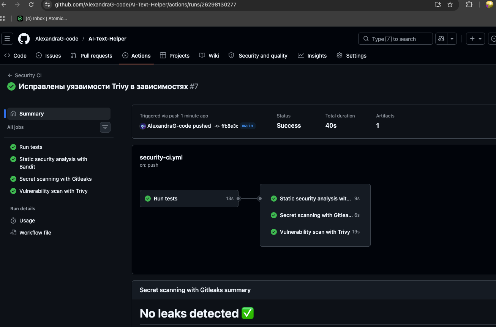

# Practice108 — Security CI

## Описание работы

В рамках работы был настроен CI-процесс с автоматическими проверками безопасности для проекта **AI Text Helper**.

AI Text Helper — это микросервисное веб-приложение для обработки текста. Проект включает frontend, backend, worker, Redis и Nginx и запускается через Docker Compose.

## Ссылка на репозиторий проекта

```
https://github.com/AlexandraG-code/AI-Text-Helper
```

## Цель работы

Цель работы — встроить автоматические проверки безопасности в процесс сборки и проверки программного проекта.

## Используемая платформа CI

Для настройки pipeline используется **GitHub Actions**.

Workflow находится в проекте по пути:

```text
.github/workflows/security-ci.yml
```

## Когда запускается pipeline

Security CI автоматически запускается:

- при `push` в ветку `main`;
- при создании `pull request` в ветку `main`.

## Что проверяет pipeline

В workflow настроены следующие этапы:

| Этап | Инструмент | Назначение |
|---|---|---|
| Автотесты | pytest | Запуск тестов backend |
| Статический анализ кода | Bandit | Поиск проблем безопасности в Python-коде |
| Поиск секретов | Gitleaks | Поиск токенов, паролей и ключей в репозитории |
| Проверка уязвимостей | Trivy | Сканирование проекта на известные уязвимости |

## Описание workflow

Pipeline выполняет следующие действия:

1. Загружает код репозитория.
2. Устанавливает Python и зависимости проекта.
3. Запускает автотесты.
4. Выполняет статический анализ кода с помощью Bandit.
5. Проверяет репозиторий на наличие секретов с помощью Gitleaks.
6. Выполняет проверку безопасности проекта с помощью Trivy.

## Результат выполнения

После настройки workflow был выполнен успешный запуск Security CI в GitHub Actions.

Все этапы pipeline завершились успешно:

- тесты прошли;
- статический анализ кода выполнен;
- секреты в репозитории не найдены;
- проверка безопасности выполнена.

## Скриншот

Скриншот успешного выполнения pipeline:



## Запуск проекта локально

Для запуска проекта локально используется команда:

```bash
docker compose up --build
```

После запуска приложение доступно по адресу:

```text
http://localhost
```

## Вывод

В результате работы был настроен Security CI pipeline на базе GitHub Actions. В процесс проверки проекта были добавлены автотесты, статический анализ исходного кода, поиск секретов и проверка безопасности проекта.
